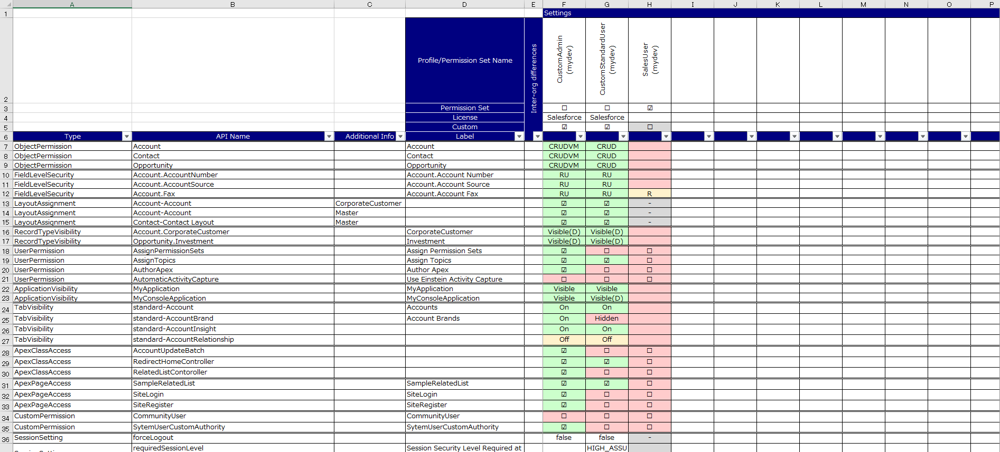

# compare-permissions
<p align="center">
  
  
  
  
</p>

[English](./README.md)  
Salesforceのプロファイルと権限セットの設定値をExcelに出力し、比較します。

## 概要
Salesforceのプロファイルと権限セットの設定値をExcelに出力するCLIツールです。  
複数組織を対象とした出力にも対応しており、Excel上で組織間の設定値を比較することができます。  
以下の設定種別の出力に対応しています。

* オブジェクト権限
* 項目レベルセキュリティ
* 割り当てレイアウト
* 表示可能レコードタイプ
* システム管理者/一般ユーザ権限
* 参照可能アプリケーション
* 表示可能タブ
* 有効なApexクラス
* 有効なVisualForceページアクセス
* 有効なカスタム権限
* ログインIPアドレス制限
* セッション設定
* パスワードポリシー

## 出力結果イメージ
[](./images/sample.png)

## インストール
[Node.js](https://nodejs.org/)をインストールし、以下のファイルを任意のディレクトリに配置します。user_config_ja.yamlについては、user_config.yamlにリネームすると、設定ファイルの指定オプション無しで起動ができます。

* compare-permissions.js
* user_config_ja.yaml
* app_config_ja.yaml
* template_ja.xlsx
* package.json
* package-lock.json

※*_jaのファイルはconfigs/ja配下にあります。

以下のコマンドを実行し、必要なライブラリをインストールします。
```
$ npm ci
```

## 設定ファイルの編集
user_configを開き、組織名、ログインURL、ユーザ名、パスワードを環境に合わせて変更します。
```
org:
  - name: (任意の組織名1)
    loginUrl: "https://test.salesforce.com"
    apiVersion : "56.0"
    userName: "(ユーザ名)"
    password: "(パスワード)"
#  - name: (任意の組織名2)
#    loginUrl: "https://login.salesforce.com"
#    apiVersion : "56.0"
#    userName: "(ユーザ名)"
#    password: "(パスワード)"
```

出力対象とするプロファイル、権限セットを定義します。権限セットの場合には"ps: true"を付与します。
```
target:
  - name: "カスタムシステム管理者"
  - name: "カスタム一般ユーザ"
  - name: "営業ユーザ"
    ps: true
```

出力対象の設定種別、及び出力順を変更したい場合は以下を編集します。
```
settingType: [
  "ObjectPermission",
  "FieldLevelSecurity",
  "LayoutAssignment",
  "RecordTypeVisibility",
  "UserPermission",
  "ApplicationVisibility",
  "TabVisibility",
  "ApexClassAccess",
  "ApexPageAccess",
  "CustomPermission",
  "LoginIpRange",
  "SessionSetting",
  "PasswordPolicy"
]
```

出力対象のオブジェクトを定義します。もし、このパラメータが未定義だった場合はプロファイル/権限セットに含まれる全オブジェクトを対象に出力します。
```
object: [
  Account, 
  Contact, 
  Opportunity, 
  User, 
]

```

## 使用方法
ターミナルでNode.jsを使用してcompare-permission.jsを実行します。オプションの指定が無い場合は、設定ファイルはデフォルトのファイルが使用されます。(デフォルトは"./user_config.yaml")
```
$ node compare-permissions.js
```
実行中のログが画面に出力されます。
```
[2022/11/27 19:55:24] Settings:
[2022/11/27 19:55:24]   AppConfigPath:app_config_ja.yaml
[2022/11/27 19:55:24]   TemplateFilePath:template_ja.xlsx
[2022/11/27 19:55:24]   ResultFilePath:result.xlsx
[2022/11/27 19:55:24]   ExcelFormatCopy:true
[2022/11/27 19:55:24]   TargetProfiles/PermissionSets:カスタムシステム管理者,カスタム一般ユーザ,営業ユーザ(PS)
[2022/11/27 19:55:24]   TargetSettingTypes:ObjectPermission,LayoutAssignment,RecordTypeVisibility,UserPermission,ApplicationVisibility,TabVisibility,ApexClassAccess,ApexPageAccess,CustomPermission,LoginIpRange,SessionSetting,PasswordPolicy
[2022/11/27 19:55:24]   TargetObjects:undefined
[2022/11/27 19:55:24] **** Start to retrieve ****
[2022/11/27 19:55:24] OrgInfo:
[2022/11/27 19:55:24]   Name:(YOUR ORG NAME)
[2022/11/27 19:55:24]   LoginUrl:https://login.salesforce.com
[2022/11/27 19:55:24]   ApiVersion:56.0
[2022/11/27 19:55:24]   UserName:(YOUR USER NAME)
[2022/11/27 19:55:32] [Profile:カスタムシステム管理者] Retrieve base info.
[2022/11/27 19:55:32] [Profile:カスタムシステム管理者] Retrieve object permissions.
[2022/11/27 19:55:32] [Profile:カスタムシステム管理者] Retrieve layout assignments.
:
[2022/11/27 19:57:46] Export to an excel file.
[2022/11/27 19:57:56] Done.
```
実行が完了すれば、結果のExcelファイルが出力されます。(デフォルトは"./result.xlsx")

実行時に使用可能なオプションは以下となります。
```
usage: compare-permissions.js [-options]
    -c <pathname> specifies a config file path (default is ./user_config.yaml)
    -s            don't display logs of the execution
    -h            output usage
````

## 注意事項
- 各ラベルは可能な限り出力していますが、一部のラベルは出力されていません。
- Excelの出力行が大量になった場合は、Excelを開く際にエラーが発生する場合があります。その場合は以下のいずれかを試してください。
  - user_config.yamlの'excelFormatCopy'をfalseに変更する。
  - 別のuser_config.yamlを作成し、出力行が多い'settingType'のみに絞ってください。(FieldLevelSecurityなど)
- セッション設定は一部の設定のみを出力しています。
- 接続ユーザのプロファイルに高保証が設定されている場合、接続に失敗します。

## ライセンス
compare-permissionsはMITライセンスを適用しています。

