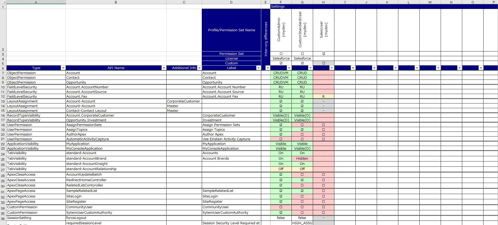

# compare-permissions
<p align="center">
  
  
  
  
</p>

[Japanese](./README-ja.md)  

Salesforce's profile and permission set settings exporter to Excel and compare
## Description
Compare permissions is a CLI tool that exports Salesforce's profile and permission set settings to Excel.  
It also supports multiple organizations and makes it possible to compare their settings on Excel.  
The following settings are supported.

* Object Permission
* Field Level Security
* Layout Assignment
* Record Type Visibility
* User Permission
* Application Visibility
* Tab Visibility
* Apex Class Access
* Visualforce Page Access
* Custom Permission
* Login IP Range
* Session Setting
* Password Policy

## Output image
[](./images/sample.png)

## Installation
Install [Node.js](https://nodejs.org/) and place the following files in any directory.

* compare-permissions.js
* user_config.yaml
* app_config.yaml
* template.xlsx
* package.json
* package-lock.json

Execute the following command to install the required libraries.
```
$ npm ci
```

## Edit config file
Open user_config.yaml and edit the organization name, login URL, user name, and password to match your environment.
```
org:
  - name: (ANY ORGANIZATION NAME 1)
    loginUrl: "https://test.salesforce.com"
    apiVersion : "56.0"
    userName: "(YOUR USER NAME)"
    password: "(YOUR USER PASSWORD)"
#  - name: (ANY ORGANIZATION NAME 2)
#    loginUrl: "https://login.salesforce.com"
#    apiVersion : "56.0"
#    userName: "(YOUR USER NAME)"
#    password: "(YOUR USER PASSWORD)"
```

Edit the profile name and permission set name(label) of the output target. For permission sets, add "ps: true".
```
target:
  - name: "CustomAdmin"
  - name: "CustomStandardUser"
  - name: "SalesUser"
    ps: true
```

Edit the output setting types or order.
```
settingType: [
  "ObjectPermission",
  "FieldLevelSecurity",
  "LayoutAssignment",
  "RecordTypeVisibility",
  "UserPermission",
  "ApplicationVisibility",
  "TabVisibility",
  "ApexClassAccess",
  "ApexPageAccess",
  "CustomPermission",
  "LoginIpRange",
  "SessionSetting",
  "PasswordPolicy"
]
```

Edit the output target objects. If this parameter is not defined, All objects included in the profiles/permission sets are output targets.
```
object: [
  Account, 
  Contact, 
  Opportunity, 
  User, 
]

```

## Usage

Execute a compare-permission with Node.js in a terminal. If there is no option, It uses the default config file. (default is "./user_config.yaml")
```
$ node compare-permissions.js
```
Execute logs are output to screen.
```
[2022/11/27 19:11:22] Settings:
[2022/11/27 19:11:22]   AppConfigPath:app_config.yaml
[2022/11/27 19:11:22]   TemplateFilePath:template.xlsx
[2022/11/27 19:11:22]   ResultFilePath:result.xlsx
[2022/11/27 19:11:22]   ExcelFormatCopy:true
[2022/11/27 19:11:22]   TargetProfiles/PermissionSets:CustomAdmin,CustomStandardUser,SalesUser(PS)
[2022/11/27 19:11:22]   TargetSettingTypes:ObjectPermission,LayoutAssignment,RecordTypeVisibility,UserPermission,ApplicationVisibility,TabVisibility,ApexClassAccess,ApexPageAccess,CustomPermission,LoginIpRange,SessionSetting,PasswordPolicy
[2022/11/27 19:11:22]   TargetObjects:undefined
[2022/11/27 19:11:22] **** Start to retrieve ****
[2022/11/27 19:11:22] OrgInfo:
[2022/11/27 19:11:22]   Name:(YOUR ORG NAME)
[2022/11/27 19:11:22]   LoginUrl:https://login.salesforce.com
[2022/11/27 19:11:22]   ApiVersion:56.0
[2022/11/27 19:11:22]   UserName:(YOUR USER NAME)
[2022/11/27 19:11:26] [Profile:CustomAdmin] Retrieve base info.
[2022/11/27 19:11:26] [Profile:CustomAdmin] Retrieve object permissions.
[2022/11/27 19:11:26] [Profile:CustomAdmin] Retrieve layout assignments.
:
[2022/11/27 19:11:49] Export to an excel file.
[2022/11/27 19:12:00] Done.
```
When complete the execution, the result excel file will be output. (default is "./result.xlsx")

The following options can be used.
```
usage: compare-permissions.js [-options]
    -c <pathname> specifies a config file path (default is ./user_config.yaml)
    -s            don't display logs of the execution
    -h            output usage
````

## Note
- Labels are output as much as possible, but some can not output.
- If there are too many rows in the excel file, an error may occur when opening the excel file. In that case, Please try one of the following.
  - Change the 'excelFormatCopy' setting in user_config.yaml to false.
  - Create another user_config.yaml focused on 'settingType' that outputs a lot of data(e.g., FieldLevelSecurity).
- SessionSetting is output only some of the settings.
- If the connected user's profile is set to High Assurance, the connection will fail.

## License
compare-permissions is licensed under the MIT license.

